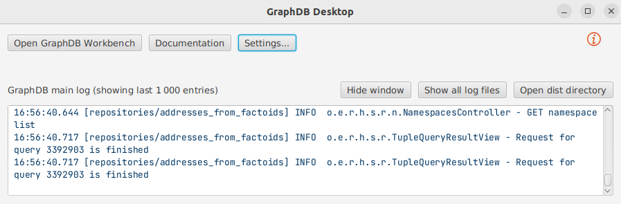
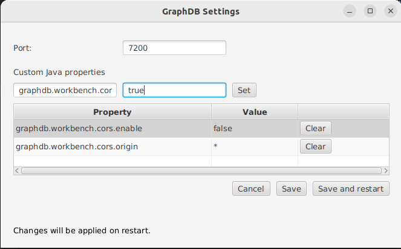

# Web visualisation for timeline

This repository contains the documentation of the ODySSEA (Ontology of spatio-temporal dynamics for geographical entities and addresses) ontology and knowledge graph construction method.

## Structure of the repository
```
├── styles                    <- CSS files to describe the style of web page
├── scripts                   <- JS files to describe the actions while launching page and interacting with it
│   ├── functions.js          <- Functions which are specific to the web page
│   ├── geometry.js           <- Functions deal with geometries (geometric transformations for instance)
│   ├── jquery-3.6.1.js       <- File to use [jQuery](https://jquery.com/)
│   ├── queries.js            <- Functions to build SPARQL queries
│   ├── script.js             <- Main script to be launched during web page loading 
│   ├── time.js               <- Functions to manage time
│   ├── timeline.js           <- File to use [timeline.js](https://timeline.knightlab.com/)
├── settings.js               <- Settings of GraphDB repository to interact with it (URL, lang, repository name...)
├── index.html                <- Web page to open
└── README.md
```

## Requirements

Before launching the web app, please ensure `settings.js` is correctly filled out :
* `graphDBURL`: URL of the GraphDB ;
* `graphName`  name of the repository ;
* `lmLabelLang`: selected language of the labels of landmarks ;
* `namedGraphName`: name of the named graph in which the final construction is made.

Then, to allow the interaction with the repository, you have to avoid CORS errors. To do so, click on `Settings...` in GraphDB Desktop window.



Next, you can custom properties by typing their name and value.



Properties are the following ones:
* `graphdb.workbench.cors.enable`:`true` 
* `graphdb.workbench.cors.origin`:`*`

Now you can launch the web app.